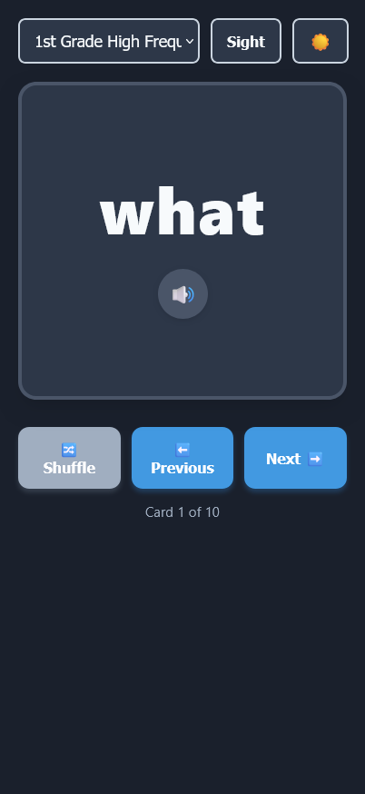
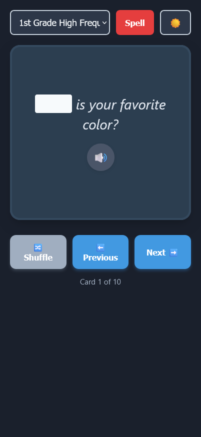

# wordcards

An open-source, lightweight, interactive flashcard application designed specifically for early learners to practice spelling words and sight high-frequency vocabulary. Built entirely using pure HTML, CSS, and modular JavaScript, this app runs entirely client-side, making it perfect for offline local usage or zero-maintenance hosting via GitHub Pages.

---

## ▶️ Live Demo

Try out wordcards here: https://leoclee.github.io/wordcards

---

## ✨ Features

*   **Sight Word First Flow:** Built for instant recall.
*   **Text-to-Speech:** Reads the word and context sentence aloud.
*   **Spelling Mode:** Redacts the target word completely on both the front face and back face. Perfect for practicing for auditory-first spelling tests.
*   **Shuffling:** Shuffle the cards to avoid memorization of list order.
*   **"ALL" List:** Practice words from all configured lists.
*   **Dark/Light Mode**
*   **Keyboard Shortcuts:** Desktop users can navigate with speed using dedicated keyboard shortcuts.

---
add
## ✨ Screenshots





---

## 🛠️ Project Files

To organize your project or customize words, keep the following structure in your repository:

```text
├── index.html       # main interface layout structure
├── style.css        # look-and-feel
├── script.js        # app logic
└── words.js         # word and sentence data
```

---

## 🚀 Quick Setup (Local Mode)

1. Download all files into the **same folder** on your computer.
2. Open or create your custom data payload inside `words.js` following this data scheme (note that sentence is optional):
    ```javascript
    const FLASHCARD_DATA = {
      "My Custom List 1": [
        { "word": "beautiful", "sentence": "The sunset looks beautiful." },
        { "word": "because", "sentence": "I stayed inside because it rained." },
        { "word": "awesome" }
      ]
    };
    ```
3. Double-click `index.html` to run your flashcards right in a browser.

---

## 🌐 Deploying to GitHub Pages (Free Hosting!)

To open these cards on a tablet, iPhone, or Android device, you can host it for free using GitHub Pages:

1. **Fork** this repository on your GitHub profile.
2. On GitHub, navigate to your repository's **Settings** tab.
3. Click on **Pages** in the left-hand sidebar layout.
4. Under **Build and deployment**, set the source branch selection to `main` and target directory path to `/root`. Click **Save**.
5. GitHub will generate a permanent web URL where your app is hosted live:
   `https://YOUR_GITHUB_USERNAME.github.io/YOUR_REPO_NAME/`

---

## ⚖️ License

MIT License. Feel free to copy, fork, modify, and use this project for any home, classroom, or educational study routine!
